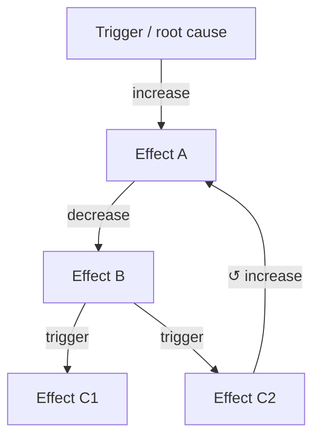

# LLM Wiki Schema

This file defines how this wiki works. It is the behavioral schema for the LLM that maintains it.
The LLM reads this file at the start of every session before doing any ingest, query, or lint work.

---

## What this wiki is

A persistent, compounding knowledge base built from source documents in any domain. The wiki
synthesizes, cross-links, and compounds knowledge so that each new source added and each question
answered makes the whole richer.

The wiki is NOT a search index over raw source documents. It is a synthesized, cross-linked
artifact where knowledge is compiled once, kept current, and gets richer with every source added
and every question asked. Do not re-derive answers from raw sources at query time — read the wiki
pages.

---

## Directory layout

```
[project-wiki]/
├── CLAUDE.md          ← this file — the behavioral schema (the rulebook the LLM reads every session)
├── README.md          ← project overview and setup guide
├── LICENSE            ← MIT
├── index.md           ← catalog of every wiki page (the LLM keeps this current)
├── home-page.md        ← Obsidian Map of Content (A–Z index) — AUTO-GENERATED by the home-page-moc skill; never hand-edit
├── log.md             ← append-only history of ingests, contradictions, lint passes, URL acquisitions
├── raw/               ← source documents — IMMUTABLE, read-only, never modify
│   ├── 0001_source-document/      ← one folder per source, self-contained; NNNN_ = catalog ID
│   │   ├── article.md             ← the source text (filename may vary)
│   │   └── images/                ← assets referenced by relative links from the source text
│   │       ├── figure-001.png
│   │       └── ...
│   ├── 0002_another-source/
│   │   ├── paper.md
│   │   └── figures/
│   └── ... (one folder per source document)
└── wiki/              ← the synthesized, cross-linked knowledge base (LLM-maintained)
    ├── concepts/      ← abstract ideas, named entities, domain terms
    ├── tools/         ← specific named tools, systems, interventions (if the domain includes these)
    ├── workflows/     ← repeatable step-by-step processes and techniques
    ├── setup-guides/  ← installation / configuration walkthroughs (if applicable)
    ├── causal-chains/ ← explicit multi-step cause-effect pathway maps
    └── metaphors/     ← domain-specific teaching analogies
```

**Each source document gets its own folder inside `raw/`.** This keeps every source a
self-contained, portable unit: the source text and the assets it references travel together, and
the relative image links inside the text (e.g. ``) keep working
without any edits. Never flatten assets into a shared folder — filenames collide across sources
(many have a `cover.jpg`) and flattening would force rewriting links inside the source, violating
the immutability rule. The folder name is `NNNN_<slug>` — a frozen catalog ID followed by a unique
kebab-case slug. See Source folder naming under File naming.

**The wiki root may be a dedicated directory or may coincide with an existing repository root.**
When embedded in a larger repo, `index.md`, `log.md`, and the `wiki/` and `raw/` folders live at
that repo root alongside this schema file — there is no separate wiki subdirectory. Normally this
schema **is** the repo's `CLAUDE.md`, so Claude Code auto-loads it at the start of every session.
Only if the repo already uses `CLAUDE.md` for a different, conflicting purpose should this schema be
kept under another name (e.g. `WIKI_CLAUDE.md`) and pointed to manually. All paths in this schema
are relative to the wiki root, wherever it sits.

---

## Page types

Every wiki page has one of six types. Use the type that best fits the primary purpose of the page.

| Type | Subfolder | Use for |
|------|-----------|---------|
| `concept` | `wiki/concepts/` | Abstract ideas, named entities, or domain terms the reader needs to understand |
| `tool` | `wiki/tools/` | A specific named tool, integration, system, or named intervention |
| `workflow` | `wiki/workflows/` | A repeatable process or technique |
| `setup-guide` | `wiki/setup-guides/` | Installation, configuration, or onboarding steps |
| `causal-chain` | `wiki/causal-chains/` | An explicit multi-step cause-effect pathway tracing how one state leads to another |
| `metaphor` | `wiki/metaphors/` | Teaching analogies that make abstract concepts concrete and actionable |

---

## Page format

Every wiki page must follow this template exactly. Omit sections that genuinely do not apply,
but do not invent sections not listed here.

```markdown
---
type: concept | tool | workflow | setup-guide | causal-chain | metaphor
sources: [list of raw/ paths this page draws from, e.g. raw/0003_03-sample-article/article.md]
external_knowledge: []   ← populated only if LLM knowledge fills a gap; each entry must cite a reputable source AND name the model used
moc_mirror: swapped-operand-slug   ← OPTIONAL, only on `-vs-` pages. The swapped-operand form of this page's slug (e.g. on functional-vs-conventional-paradigm → moc_mirror: conventional-vs-functional-paradigm). The home-page-moc generator reads it to emit a mirror entry under the other letter. It cannot be derived by string-swapping (a shared trailing noun must stay pinned), so it must be declared here.
tags: [2-5 lowercase tags]
last_updated: YYYY-MM-DD HH:mm:ss
---

# [Page Title]

## One-liner
One sentence. What is this, in plain language the target reader understands immediately.

## What it is
2-4 sentences. The concept, mechanism, or purpose. WHY it matters, not just what it is.

## How it works
[For concepts: the mechanism explained simply.]
[For tools: what the tool does and how it connects to the domain.]
[For workflows: numbered steps.]
[For setup-guides: numbered steps with exact commands or UI actions.]
[For causal-chains: see the Causal chain page format section below.]
[For metaphors: the full analogy and what each part maps to.]

## When to use it
[For concepts: when this concept becomes relevant in practice.]
[For tools: what problem this tool solves and when to reach for it.]
[For workflows: the trigger condition — when should someone run this workflow?]
[For setup-guides: prerequisites and when setup is needed.]
[For metaphors: which teaching moment this metaphor is designed for.]

## What causes this   ← Optional. Include on concept pages when this entity is an outcome or effect.
- [[upstream-entity]] — [increase | decrease | activate | inhibit | trigger | other]: [brief mechanism]
- [[another-upstream]] — [direction]: [brief mechanism]

## What this causes   ← Optional. Include on concept pages when this entity has downstream effects.
- [[downstream-entity]] — [increase | decrease | activate | inhibit | trigger | other]: [brief mechanism]
- [[another-downstream]] — [direction]: [brief mechanism]

> **Mandatory format for causal bullets.** Every bullet in `What causes this` / `What this causes`
> MUST lead with the target and an explicit direction token, then a colon, then prose:
> `- [[entity]] — <direction>: <mechanism>`. Use a wikilink when the target has, or warrants, its own
> page; otherwise use a plain **bold** noun phrase for the target (`- **detail fidelity** — decrease:
> …`). Do not bury the target or the direction inside a prose sentence (write
> `- [[compaction]] — trigger: at ~70-80% full, detail is summarized away`, NOT
> `- When the window fills, [[compaction]] triggers and detail is lost`). The lead `target —
> <direction>` is what makes upstream/downstream traversal and the symptom→cause-tree query reliable;
> the prose after the colon is for the human reader.

## Gotchas
[Optional. Only include if the source material explicitly calls out a common mistake,
 a counterintuitive behavior, or a failure mode worth knowing.]

## See source for fuller detail   ← Optional and RARE. Only when this page deliberately compresses
                                     something a reader would plausibly want in full. See the rule below.
- [brief description of what was condensed] — [[raw/0001_…/article.md]]

## Contradictions flagged   ← Only include when a known source conflict applies to this page.
- **[raw/file-a.md] vs [raw/file-b.md]:** [Description of conflicting claims.]
  LLM assessment ([model name], [YYYY-MM-DD HH:mm:ss]): [short plausibility analysis — see contradiction protocol]
  Contradiction severity: hard | soft | scope   ← REQUIRED. Exactly one token — the severity from the
                                                  Contradiction severity levels table, written
                                                  machine-readably so any automation can act on it
                                                  deterministically instead of guessing from prose.
  Status: Unresolved — flagged for user review | Resolved — kept [A/B] because [reason]

## Related
- [[page-slug]] — one-line description of the relationship
```

### The "See source for fuller detail" pointer — use it sparingly

Every wiki page is a deliberate compaction of its source: it synthesizes and drops detail by design.
Usually that is fine — the `sources:` frontmatter already records where the page came from, and `raw/`
is always available. The `See source for fuller detail` section is for the **occasional** case where a
page knowingly omits something a reader would plausibly want in full — e.g. the source lists six
sub-steps and the page summarizes them in one line, or the source gives exact figures the page rounds.

Rules:
1. **This is a rare, deliberate affordance — not a disclaimer.** It must point at a *specific* omission worth drilling into, with a one-line description of what was condensed and a link to the source.
2. **Never add it as boilerplate.** Do not put a generic "some detail may have been omitted, see source" on every page. A pointer that appears everywhere is noise readers learn to ignore, and it drowns out the rare pointer that actually matters. If in doubt, leave it off.
3. **It does not replace `sources:`.** Every page still lists its sources in frontmatter regardless; this section is an in-body signpost to a particular compressed spot, used only when that spot is worth flagging.

---

## Causal chain page format

`causal-chain` pages use this format instead of the generic template above.

```markdown
---
type: causal-chain
sources: [list of raw/ paths this chain draws from, e.g. raw/0003_03-sample-article/article.md]
external_knowledge:
  - claim: "[the bridging claim supplied by LLM general knowledge]"
    source: "[reputable source — author, publication, year, or URL]"
    model: "[exact model name/version that supplied this knowledge, e.g. claude-sonnet-4-6]"
    added: "[YYYY-MM-DD HH:mm:ss]"
tags: [tags]
last_updated: YYYY-MM-DD HH:mm:ss
---

# [Chain Name] — Causal Pathway

## One-liner
One sentence: what is the trigger, and what is the end state this chain traces?

## Chain (visual)

Two synced renderings of the ordered flow (both mirror the canonical Links table below).

**(a) Mermaid flowchart** (preferred) — renders as a graphical diagram on GitHub, in Obsidian, and
in VS Code with a Mermaid extension. Use `flowchart TD`, one node per entity, the direction token on
each edge label, and for a feedback loop draw the edge back to the earlier node with `↺` in its label:



**(b) ASCII fallback** — a plain-text version in a fenced code block that renders in any viewer with
no extension. At a branch, indent the sub-paths; for a feedback loop, draw the final arrow back to
the earlier node it feeds and label it `↺ loop`:

```
[Trigger / Root cause]
      ↓ increases
[Effect A]
      ↓ decreases
[Effect B]
      ↓ triggers
[Branching node] ──► [Effect C1]   (decrease)
                 └─► [Effect C2]   (increase)
```

## Links (canonical)

The machine-traversable representation — one row per causal edge. This table is the source of truth
for traversal and the symptom→cause-tree query; the diagram above is just its picture. Every row
MUST have an explicit direction token and a Source. Quote the source where possible (it makes each
link auditable); use `EXTERNAL` for any link supplied by LLM general knowledge (and fill in the
`external_knowledge` frontmatter + `External knowledge used` section).

| From | Direction | To | Mechanism | Source |
|------|-----------|----|-----------|--------|
| [[trigger-page]] | increase | [[effect-a-page]] | how the trigger causes A | raw/00NN_…/article.md — "quote" |
| [[effect-a-page]] | decrease | [[effect-b-page]] | how A causes B | raw/00NN_…/article.md — "quote" |
| [[effect-b-page]] | trigger | [[c1-page]] | how B causes C1 | EXTERNAL |
| [[effect-b-page]] | increase | [[c2-page]] | how B causes C2 | raw/00NN_…/article.md — "quote" |

(Branches are simply two rows sharing the same `From`. Direction token vocabulary: increase /
decrease / activate / inhibit / trigger / suppress / enable / block.)

**Feedback loops (cyclic chains).** A chain is a *loop* when a later node feeds back into an earlier
one. Represent the loop-back as a normal Links row whose `To` is an earlier node in the chain, and
mark that row by prefixing the `To` cell with `↺ ` (e.g. `↺ [[effect-a-page]]`) so traversal can
detect that the edge closes a cycle rather than continuing forward. Every cyclic chain MUST also
carry a `## Loop` section (below) naming the loop-back edge and whether the loop is **reinforcing**
(amplifies — each pass strengthens the cycle, e.g. a virtuous/vicious circle) or **balancing**
(dampens — each pass moves toward equilibrium). A chain with no loop-back row is linear; omit the
`## Loop` section for it.

## Node index
All nodes in this chain, in order: [[trigger-page]], [[effect-a-page]], [[effect-b-page]], [[c1-page]], [[c2-page]]
[For a cyclic chain, append: `(cyclic: [[last-node]] loops back to [[earlier-node]])`.]

## Loop   ← Only for cyclic chains (feedback loops). Omit entirely for linear chains.
This chain is a feedback loop: [[last-node]] feeds back into [[earlier-node]] (<direction>), making
it **reinforcing** | **balancing**. One pass around the loop: [one line on what each cycle does and
what, if anything, eventually limits it].

## External knowledge used
[Only include if any link came from LLM general knowledge rather than a source document.]
- **[Bridging claim]** — Source: [reputable citation] — Model: [model name/version] — Added: [YYYY-MM-DD HH:mm:ss]

## Contradictions flagged
[Only include if a source conflict affects this chain.]
- **[raw/file-a.md] vs [raw/file-b.md]:** [conflicting claims]. Contradiction severity: hard | soft | scope. Status: Unresolved | Resolved — [reason]

## Related
- [[related-chain]] — description of how the chains connect
```

---

## File naming

- Use kebab-case for all wiki page filenames: `context-window.md`, `manual-compaction.md`
- Match the page title closely but keep it short: `water-tank.md` not `the-water-tank-metaphor-for-context-capacity.md`
- Wikilinks use the filename without extension: `[[context-window]]`, `[[manual-compaction]]`
- **Use sentence case for page titles and all headings** — capitalize only the first word plus proper
  nouns and literal tokens (`Firecrawl`, `CLAUDE.md`); do not use title case. Write `## How it works`,
  not `## How It Works`. This matches the standard documentation style (Google / Microsoft / GitHub
  guides) and is easier to apply consistently than per-word title-case judgments. Two deliberate
  exceptions, both proper labels rather than prose headings: a document's H1 title (e.g. the wiki's own
  name) and the fixed page-type category labels in `index.md` (`Concepts`, `Tools`, `Setup Guides`,
  `Causal Chains`, `Metaphors`).

### Source folder naming

Each source folder in `raw/` is named `NNNN_<slug>`:

- **`NNNN`** is a zero-padded 4-digit **catalog ID** — exactly four numeric digits, `0`–`9` only (no letters, no hex, no symbols), matching `^[0-9]{4}$`. It is assigned in sequence the moment the source is added to `raw/` (`0001`, `0002`, …) and gives every source — numbered series and one-off alike — a uniform, sortable, unique handle.
- **`<slug>`** is a unique kebab-case name for the source. If the source carries its own meaningful sequence (e.g. a numbered article series), keep that inside the slug (`0003_03-sample-article`): the catalog ID is additive metadata, not a replacement for the source's own ordering.
- **The catalog ID is a stable handle, not an ingestion-order field.** True ingestion chronology lives in `log.md` with full timestamps — do not infer it from the catalog ID.
- **Assign once, freeze forever.** The folder name is embedded in every page's `sources:` frontmatter and in image link-back paths, so it is load-bearing. If a source is ever removed, **leave the gap** — never renumber existing folders.

### Path conventions (two distinct kinds)

These look similar but differ deliberately — do not mix them:

- **`sources:` frontmatter** uses a **root-relative** path: `raw/0001_sample-source/article.md`. This is a canonical metadata reference, not a clickable link, so it reads the same on every page regardless of where the page sits.
- **Image embeds** (and any in-body link that must actually resolve) use a **page-relative** path: from a page in `wiki/concepts/`, that is `../../raw/0001_sample-source/images/foo.png`. Wiki pages sit two levels below the wiki root, so the `../../` prefix is required for the markdown link to resolve.

### The source layer is provenance, not graph nodes

`raw/` is the **source/provenance layer**, distinct from the synthesized **knowledge layer** in `wiki/`.
A page records where it came from with the `sources:` frontmatter path and plain-text inline
citations (`raw/0001_…/article.md (slide N)`) — **neither is a `[[wikilink]]`, so neither creates an
Obsidian graph edge, by design.** The synthesized layer (`wiki/**`, `index.md`) is the knowledge graph;
the source packages sit beneath it and are reached by their `sources:` path, the source-PDF link, or
backlink search — not by being graph nodes. (The only sanctioned `[[raw/…]]` wikilink is the rare
`See source for fuller detail` pointer.)

Consequences to expect and **not** to "fix" by integrating sources into the graph:
- Every `raw/NNNN_…/article.md` is an **orphan in Graph View** — correct: it has no inbound wikilinks.
- Every source node is **labelled `article`** — Obsidian labels a node by its *filename*, not its H1,
  and the pipeline names every source package `article.md` (the descriptive name is on the *folder*).
  Do **not** rename `article.md` to make labels descriptive: source paths are frozen and load-bearing
  (see *Source folder naming*), so a rename silently breaks every citing page for a cosmetic label.

**Exclude the source layer from Graph View** so the graph shows only the synthesized knowledge web:
in the graph's search/filter box (or `.obsidian/graph.json` `"search"`, which is machine-local and
git-ignored) set **`-path:"raw/"`**. Keep `showOrphans: true` so a genuine orphan *wiki* page still
surfaces as a real lint signal — only `raw/` is an **expected** orphan.

### Forward links are expected

Cross-link liberally, including to pages that **do not exist yet**. A `[[page-slug]]` pointing at a
not-yet-created page is not an error — it marks a page worth writing when its source is ingested
(e.g. linking `[[claudemd-files]]` before the CC4E #5 source is added). The lint workflow tracks
these as missing pages and they resolve as more sources come in. Do not suppress a useful link
merely because its target page is absent.

A forward link resolves **automatically** the moment a page file with the matching name is created —
no edit to the linking pages is needed. Whether a later ingest may create that page under the wanted
slug is governed by the orphaned-forward-link check in the Ingest workflow (step 3): the slug is
claimed only when the new page is the **same entity** the linking text refers to, not merely the same
subject. While a forward link remains unresolved and a closely related page exists, the link site may
carry a pending-pointer — `[[wanted-slug]] *(page pending — closest coverage: [[other-page]])*` —
so a reader hitting the dead link is offered the nearest existing coverage. The pointer's wording is
fixed (it must stay greppable), and lint strips it automatically once the wanted page exists.

---

## Model selection

Different parts of this work demand different levels of reasoning, and model cost scales with
capability. To match spend to need without relying on a human to remember to switch models, the
session **routes work to a subagent with an explicit model override** based on task type. The
orchestrating session makes this decision automatically — do not ask the user to switch models
manually for these tasks.

> **Capability note:** the model running the main session cannot reassign itself mid-session. The
> only programmatic way to run a task on a different model is to dispatch it to a subagent with a
> `model` override. That is the mechanism this section relies on. An instruction to "switch your own
> model" would be unexecutable, so do not add one.

| Task type | Run on | Model id | Why |
|-----------|--------|----------|-----|
| **Ingestion** (read source, extract entities, create/update pages, add links) | Subagent | `claude-sonnet-4-6` | Mechanical pattern-matching against a fixed schema. The template carries the structure; a lighter model is sufficient and far cheaper. |
| **Lint pass** | Subagent | `claude-opus-4-8` | Contradiction sweeps and consistency checks need real reasoning; a weak model fails silently here. |
| **Causal-chain construction** | Subagent | `claude-opus-4-8` | Multi-hop reasoning and direction-of-effect correctness; errors compound down the chain. |
| **Contradiction analysis** (the plausibility assessment) | Subagent | `claude-opus-4-8` | The assessment's value depends on the model's reasoning quality. |
| **Reader Q&A** | Inline (session model) | — | Answers run in the interactive thread on whatever model the session uses. Routing live Q&A through subagents loses conversational context, so it is intentionally not auto-routed. |

Routing rules:

1. When a task in the table is dispatched to a subagent, **pass the model override explicitly** and **record in `log.md` which model actually ran the task** (this is the model name captured in `external_knowledge` and contradiction-assessment entries).
2. **Effort is governed by each model's configured default — not by this schema and not by per-task dispatch.** The dispatch mechanism overrides the *model* but exposes **no** *effort* override, so a subagent simply inherits whatever effort its model is configured to. Effort is therefore coupled to the model, not the task. **Workspace convention: run all models at high effort** for consistency and to remove the one variable per-task routing cannot control. (An earlier draft prescribed "medium for ingestion, high for reasoning"; that was advisory intent that was never actually enforced — ingestion effort equals Sonnet's configured default, whatever it is set to. Do not rely on a per-task effort guarantee; there is no mechanism behind it.)
3. If subagent dispatch is unavailable in the current environment, **fall back to running inline and tell the user which model the session is on**, so they can switch via `/model` if it is mismatched to the task. Never silently run a reasoning-heavy task on a model chosen only for ingestion.
4. The model ids above are the intended defaults. If the available model lineup changes, update this table rather than hardcoding model choices elsewhere in the schema.
5. **Provenance must record the *current* session model — never the system-prompt identity string.** Every place this schema records which model did the work (`external_knowledge` frontmatter, contradiction assessments, `log.md` `Model:` lines, and any page-level model field) MUST name the model **actually active when the work ran**. The model identity stated in the session's system prompt is the model at session *start*; it goes **stale the moment the user runs `/model`** to switch mid-session, and it does not update. So do not copy the model name from that identity line by reflex — confirm the live session model (the one shown in the client's status bar / set by the last `/model`) and record that. This failure has occurred: a mid-session switch from one model to another left provenance fields naming the start-of-session model long after it had changed. When in doubt, state the model you believe is active *and* note the uncertainty rather than asserting a stale identity.

---

## Source acquisition from URL

Run this workflow when the user provides a URL to add as a source (e.g. "add source <URL>"). It
automates what the manual route does by hand — download the page as markdown plus its images,
package them into a self-contained folder in `raw/`. The manual route (user saves the page
themselves and drops the folder into `raw/`) remains the documented fallback for anything the
automation cannot fetch: gated/paywalled pages, or no fetch engine available.

1. **Fetch the page as main-content markdown.** Current engine: Firecrawl CLI —
   `firecrawl scrape <URL> --only-main-content -f markdown -o <staging>/article.md`. The workflow
   is engine-agnostic: any fetcher that produces clean main-content markdown is acceptable; if no
   engine is available, say so and point the user to the manual fallback. Build the package in a
   staging location first — it moves into `raw/` only once finalized, and immutability begins at
   that moment.
2. **Download every referenced content image** into `images/` beside the markdown. Skip obvious
   non-content assets (tracking pixels, social/share buttons, comment-widget avatars). Do NOT
   judge illustrative vs decorative here — that judgment belongs to the ingest workflow; `raw/` is
   the archive, so keep everything that is part of the article.
3. **Rewrite image links** in the markdown to relative `images/<filename>` paths so the package is
   self-contained and portable, exactly like a manually added source.
4. **Record provenance** as frontmatter at the top of `article.md`: `source_url`, `retrieved`
   (YYYY-MM-DD HH:mm:ss), `engine` (tool + version). The archival copy is a snapshot of a live
   page that can change or vanish, so provenance must be captured at creation time. This is part
   of *creating* the source, not a modification of an immutable file.
5. **Package into `raw/`:** assign the next catalog ID `NNNN`, derive a kebab-case slug from the
   page title, move the staging folder to `raw/NNNN_<slug>/` (containing `article.md` + `images/`).
6. **QA-assess the fetched content** — read the markdown and check:
   - title and author present; content reads complete — no paywall stub or truncation (a gated
     post fetched without credentials typically ends abruptly at a subscribe prompt);
   - no leftover navigation, widget, or comment-section junk;
   - every rewritten image link resolves to a downloaded file; image count plausible vs the page.
7. **Append to `log.md`:** `## [YYYY-MM-DD HH:mm:ss] acquire | <URL> → raw/NNNN_<slug>/`, including
   the engine used and the QA result.
8. **Ask the user whether to ingest now, surfacing the QA findings** so the decision is informed.
   Acquisition never auto-triggers ingestion — a bad scrape must not flow into the wiki.

> **Paywalled pages — why a logged-in URL is not enough.** Access to subscriber-only content lives
> in the browser's session cookies, not in the URL: the same URL serves the full article to a
> logged-in browser and a public preview to everyone else. The fetch engine does not share the
> user's browser session, so it receives the preview. Out of scope for now; use the manual
> fallback (save the page from the logged-in browser, drop it into `raw/` per the standard
> workflow).

---

## Ingest workflow

Run this workflow when a new raw source is added or an existing source is updated.

1. **Read** the raw source document in full.
2. **Identify** all entities worth a wiki page:
   - Concepts (abstract ideas, named entities, domain terms)
   - Tools (named tools, integrations, systems, named interventions)
   - Workflows (repeatable processes with steps)
   - Setup guides (installation or configuration sequences)
   - Causal relationships (cause-effect links — see step 5)
   - Metaphors (named analogies used to explain a concept)
3. **Check orphaned forward links before naming any new page:**
   - Compute the wanted-slug list: every `[[wikilink]]` across `wiki/` and `index.md` that has no matching page file. Ignore `[[raw/...]]` source pointers — they reference source files, not wiki pages. This is one cheap shell pass (seconds, always ground truth — no separate index file is kept), e.g.:
     `comm -23 <(rg -oI '\[\[[^\]#|]+' wiki index.md | sed 's/^\[\[//' | sort -u) <(find wiki -name '*.md' -exec basename {} .md \; | sort -u)`
   - For each new entity that resembles a wanted slug, grep for that `[[slug]]` and **read the linking sentences in context** to recover what the original link meant.
   - Reuse the wanted slug **only if the new page is genuinely the same entity** the linking text refers to — not merely the same subject. Forward links target future pages about entities, never specific source documents, so any source that truly covers the entity may create the page; later sources then update that same page.
   - **When uncertain, do not claim the slug.** Create the page under its own natural name, and at each orphaned link site append a pending-pointer in this exact form: `[[wanted-slug]] *(page pending — closest coverage: [[new-page]])*`. Lint removes the pointer once the wanted page exists. A wrongly claimed slug is silent corruption — the link "works" but points at the wrong entity; a still-orphaned link is a visible, recoverable gap.
4. **For each entity:**
   - If no wiki page exists: create one using the page format above.
   - If a page exists: read it, then update it — add new information, update `sources` and `last_updated` frontmatter.
   - **On every update, actively scan for contradictions** between the incoming source and what the page already says. See the Contradiction detection and resolution section. Do not silently overwrite — flag every conflict.
5. **Identify causal relationships:**
   - Scan for causal language: "causes," "leads to," "triggers," "results in," "inhibits," "suppresses," "increases," "decreases," "is associated with," "activates," "blocks," and domain-specific equivalents. Include cause-effect relationships depicted in kept images (diagram arrows, flow charts) — see Images and assets rule 3.
   - For each causal statement, identify the source node and target node. Record the direction of effect (increase / decrease / activate / inhibit / trigger / suppress / other).
   - Add or update `What causes this` and `What this causes` sections on the relevant concept pages.
   - If a chain of three or more links can be assembled (A → B → C or longer), create or update a `causal-chain` page in `wiki/causal-chains/`. **When ingesting on a non-Opus subagent (the normal case), defer this:** log the chain under a `Causal-chain candidates` block in `log.md` and let the batched Opus `/wiki-compile` pass (step 10) build it — but still add the `What causes this` / `What this causes` concept-page bullets now.
   - If a causal link is not supported by any source document, mark it EXTERNAL and cite the reputable source used. See the Causal chain capability section.
6. **Handle images and assets** — see the Images and assets section below.
7. **Update `index.md`:** add or update the entry for every page touched.
8. **Append to `log.md`:** one entry per ingest, format: `## [YYYY-MM-DD HH:mm:ss] ingest | [Source Title]`
9. **Regenerate `home-page.md`** as the last build step of the ingest — run the `home-page-moc`
   generator skill (`python <skills>/home-page-moc.py --root .`). This rewrites the Obsidian Map of
   Content from the current page set so it never drifts. `home-page.md` is a build artifact — never
   hand-edit it. If this ingest created a new `-vs-` page, add a `moc_mirror: <swapped-operand-slug>`
   line to that page's frontmatter *before* regenerating, so its mirror entry appears under the other
   letter (the spelling cannot be derived by string-swapping; see Page format).
10. **Check the round boundary — don't let the finishing step be forgotten.** Ingestion defers the
    reasoning-heavy work: causal-chain construction (step 5) and the lint pass run as a batched
    **Opus** pass, the `/wiki-compile` skill — not per ingest. The one reliable trigger for that pass
    is the *end of a round of ingestion*, which only the user knows. So after completing this ingest,
    **ask the user**:
    > "Was this the last ingest in this round? If yes, I'll run `/wiki-compile` now — the finishing
    > step that builds the logged causal-chain candidates into pages and lints the new material so it
    > is fully usable. If more sources are queued, I'll defer and re-ask after the last one."
    Run `/wiki-compile` when the user confirms the round is done. **Backstop:** even mid-round, if the
    `Causal-chain candidates` logged in `log.md` since the last compile exceed ~15, surface that and
    offer to compile now, so a very long batch never sits un-compiled. `/wiki-compile` is itself safe
    to run anytime — its STEP 0 dirty-check exits cheaply (no Opus spend) when there is nothing to do,
    which also makes it the right pass to run after manual Obsidian edits (lint + MOC reconcile).

One source document typically touches 8–15 wiki pages. Cross-link liberally — if page A mentions a
concept that has its own page B, add `[[page-b]]` to A's Related section.

---

## Images and assets

Source documents may contain images. Some carry real explanatory value (a diagram of a mechanism, a
chart, an annotated screenshot); others are decorative — placed only to break up long text and
conveying no information the page depends on. During ingest, decide per image which it is.

Rules:

1. **Judge each image in context.** Read the image (filename, alt text, and the image itself) against the surrounding text. Ask: does the text rely on this image to be understood, or is it a visual breather? This is a judgment call the ingesting model makes while reading the source.
2. **Preserve illustrative images by linking back into `raw/`.** When an image carries explanatory value and belongs on a wiki page, reference it from that page with a relative link into the immutable source folder — e.g. from `wiki/metaphors/water-tank.md`: ``. Do not copy, move, or rename the image. Raw is immutable, so the path is stable.
3. **Open every image before you cite, summarize, embed, or skip it.** Never attribute content to an image you have not actually opened with the Read tool. Naming an image as the source of a claim (`raw/…/images/foo.png`), describing what a diagram or table shows, embedding it as evidence for a specific statement, or even classifying it decorative-vs-illustrative all require that you have read **that exact image** first. Inferring an image's contents from the surrounding prose — "the text here is about narrow commands, so the adjacent image probably shows that" — is **fabrication**, the same violation as inventing a source quote, and it produces confident false citations. If you have not opened an image, you may not describe it, cite it, or judge it: leave it unprocessed and let the lint pass (and its unreferenced-image check) surface it. When an ingest is interrupted, un-opened images are simply unfinished work — never paper over the gap with a guess.
4. **Synthesize image-borne information into the page text.** For every image kept as illustrative, read it and ask a second question: does it contain information **absent from the surrounding text** — figures, labels, table contents, steps in an annotated screenshot, cause-effect arrows in a diagram? If yes, that information MUST be written into the relevant page sections as text, in addition to linking the image — including causal bullets when the image depicts cause-effect. When the image depicts arrows/flows, **read each arrow's direction from its actual arrowheads at both ends, never from the diagram's overall layout**: a head at one end is one-way, heads at both ends are bidirectional. A missed second arrowhead silently turns a mutually-reinforcing (bidirectional) relationship into a one-way one and inverts the causal topology — so on a causal-chain page, render a double-headed arrow as two reciprocal links, not one. Bidirectional and upstream-pointing arrows are easiest to miss when they run counter to the expected flow or are short. A linked picture alone is invisible to wiki queries, search, and causal traversal; image-borne knowledge that stays only in the image is lost to every reader who doesn't open it. Image-derived claims are **source-grounded, not EXTERNAL** (the image is part of the source document), but cite the image path (`raw/NNNN_…/images/foo.png`) alongside the claim so it stays traceable to what a reader can verify. If part of an image is illegible (dense or small text in a screenshot), record what could not be read rather than guessing — the same no-fabrication discipline as everywhere else. When you reproduce text **verbatim** from an image (a quote, a transcribed label, a table cell), keep each transcribed sentence or cell on a single line and faithful to the source — do **not** inject newlines mid-sentence to hit a column width. Such breaks are arbitrary, do not mirror the image, and make the transcription unfaithful; this applies to quoted/transcribed image text specifically (the page's own explanatory prose follows the wiki's normal wrapping).
5. **Skip decorative images.** Do not link images whose only purpose is to break up text. Noting their existence is unnecessary.
6. **Never duplicate binaries into `wiki/`.** The wiki layer is synthesized text that points at source assets; it does not hold its own copies.
7. **When in doubt, lean toward preserving.** A wrongly-kept image is low-cost; a wrongly-dropped illustrative one loses information. The lint pass can review borderline calls.
8. **PDF-derived sources: deposit lightweight images, keep the original PDF as the master.** When a source is a PDF rasterized to per-page/per-slide images, distinguish two image generations with different jobs:
   - **Extraction images are transient.** The high-DPI PNGs (~200 DPI) produced to feed vision text/relationship extraction are *working files*, not archive material. They do **not** go into `raw/`. (The vision model downsamples to ~1568 px ≈ 150 DPI anyway, so 200 DPI buys nothing once extraction is done.)
   - **Deposit lightweight JPEGs in `raw/`.** Store per-page **JPEG at ~150 DPI** in the source folder's `images/` (e.g. `raw/0023_…/images/0387.jpg`). These exist only to render **inline** beside their extracted text and for human reference, so viewing quality is enough; this keeps `raw/` an order of magnitude smaller. Re-render them **straight from the PDF** (one clean generation), not by recompressing the extraction PNGs.
   - **Archive the original PDF once as `raw/_master/<file>.pdf`** — the full-fidelity fallback. `_master/` is a reserved non-`NNNN_` folder holding source masters shared across the PDF's derived lesson/section folders.
   - **A PDF does not render inline in markdown** (`` does not embed — you get only a click-to-open link). So the PDF is the reference-on-demand copy, never the embed. Every PDF-derived `article.md` MUST carry a one-line pointer to its master (`../_master/<file>.pdf`, opens in a new tab) so a reader who needs full fidelity of any page can reach it.

---

## Contradiction detection and resolution

Contradictions are a first-class concern. The wiki must actively find, record, and surface them —
not just catch them passively during lint. An undetected contradiction is worse than a gap,
because it produces confident wrong answers.

### When to check for contradictions

- **During every ingest** (step 4 above): every time an existing page is updated, compare the incoming claim against what the page already says. If they conflict, do not silently overwrite — flag the contradiction immediately.
- **During every query that combines two or more pages**: before synthesizing, check whether the pages being combined make compatible claims. If not, surface the conflict to the user rather than picking a side.
- **During lint**: sweep all pages for internal consistency as a backstop.

### How to flag a contradiction

When a contradiction is detected:

1. **Produce an LLM assessment** of the discrepancy. Analyze both claims against general knowledge of related facts and state which claim is more plausible and why, with a confidence qualifier. Example: "Based on general knowledge of related facts, claim A is far more plausible than claim B because [reasoning]." This assessment is advisory input for the user — it is never grounds for silently resolving the conflict. The assessment must always record the exact model name/version that produced it and a full timestamp, because assessment quality depends on which model performed the analysis.

2. **Record it on both affected pages** under `## Contradictions flagged`:
   - Name both source documents.
   - State exactly what each source says.
   - Include the LLM assessment with model name and timestamp.
   - Add a `Contradiction severity: hard | soft | scope` line — exactly one severity token from the
     severity table, machine-readable. Any automation that gates on severity keys off this token, so it
     is required, not optional; do not leave severity expressed only in prose.
   - Set the status to `Unresolved — flagged for user review`.

3. **Record it in `log.md`** immediately:
   ```
   ## [YYYY-MM-DD HH:mm:ss] contradiction | [Page title]
   Source A (raw/filename-a.md): "[exact claim from A]"
   Source B (raw/filename-b.md): "[exact claim from B]"
   LLM assessment ([model name/version]): [short plausibility analysis with reasoning]
   Contradiction severity: hard | soft | scope
   Status: Unresolved — flagged for user review
   ```

4. **Notify the user** in the current session. Do not silently resolve by choosing one source. Present both sides clearly, include the LLM assessment as advisory input, and ask the user to review.

### Contradiction severity levels

| Severity | Description | Action |
|----------|-------------|--------|
| **Hard** | Two claims that cannot both be true under any interpretation | Flag immediately. Do not synthesize until resolved. |
| **Soft** | Two claims that seem to conflict but may be compatible with added context | Flag and note the possible reconciliation. Proceed with synthesis but mark the output as tentative. |
| **Scope mismatch** | One source is more general; the other is more specific | Keep both. Document the scope difference on each page. This is not a true contradiction but must be recorded clearly. |

**Always record the chosen severity as the machine-readable `Contradiction severity: hard | soft | scope`
line** on the flagged contradiction (see the page format and the flagging protocol above) — `scope` uses
the `scope` token. The severity is not just advisory prose: any automation that gates on contradictions
acts on it (e.g. holding a commit for human review on `hard` while auto-accepting `soft`/`scope` with an
on-page flag), so a severity left implicit in prose can be misread. One explicit token per contradiction
makes the decision deterministic.

### How to assist with resolution

When the user is ready to resolve a contradiction:

1. Show both conflicting claims side by side with their source documents.
2. Present the recorded LLM assessment (with its model name and timestamp). If the current session runs a different model than the one that produced the recorded assessment, offer to re-run the analysis with the current model.
3. Note which source is more recent, more authoritative, or more specific — if determinable.
4. Ask the user which claim to keep, or whether both can be true under different conditions.
5. Update both affected pages and the log entry with the resolution and the reason.
6. If both claims can coexist (e.g., true under different conditions), document the conditions on the page — do not discard a claim when its scope can be preserved.

---

## Causal chain capability

The wiki tracks, assembles, and traverses multi-step cause-effect chains of any length. This is
useful for any domain where effects cascade: physiology, economics, ecological systems, technology
failure modes, and more.

### What the wiki tracks for causal reasoning

For every named concept or entity, the wiki tracks:

- **Upstream causes:** what entities cause or contribute to this one, by what mechanism, and in what direction
- **Downstream effects:** what entities this one causes or contributes to, by what mechanism, and in what direction
- **Direction of effect on every link:** use a consistent vocabulary — increase / decrease / activate / inhibit / trigger / suppress / enable / block. Never leave direction ambiguous.

This is captured in three places:
1. `What causes this` and `What this causes` sections on individual concept pages
2. Dedicated `causal-chain` pages for chains of 3+ links, including branches
3. Wikilinks between pages that allow traversal in either direction

### Querying causal chains

When a user asks a causal question, answer in one of three modes depending on the question:

**"What causes X?" / "What leads to X?"**
Read X's page. Report everything in `What causes this`, including direction of each effect. Traverse any `causal-chain` pages that include X as an effect node and report the full upstream path to root causes.

**"What does X cause?" / "What happens when X increases/decreases?"**
Read X's page. Report everything in `What this causes`, including direction. Traverse downstream through causal-chain pages. Report the full cascade.

**"Given symptom or outcome Y, what are the possible causes?"**
Find all causal chains and concept pages where Y appears as an effect. Traverse backwards to all root-cause nodes. Present the result as a cause tree:

```
Y is caused by:
├── A — [direction + mechanism]
│   └── A is caused by: P [direction], Q [direction]
│       └── P is caused by: S [direction]
└── B — [direction + mechanism]
    └── B is caused by: R [direction]
```

Mark any branch that includes EXTERNAL links. If a path is incomplete (a root cause is not found in the wiki), note the gap rather than fabricating an answer.

**Cyclic chains (feedback loops).** When traversing — in any of the three modes — and you reach a
node already on the current path (a loop-back edge, marked `↺` in the Links table), **stop
traversing that branch and report the cycle** instead of recursing forever. State the loop
explicitly: name the node where it closes, the direction, and whether it is **reinforcing**
(amplifies each pass) or **balancing** (settles toward equilibrium). In a cause tree, render the
closure as a leaf like `└── ↺ loops back to [[node]] (reinforcing) — see [[chain-name]]`. Every node
is visited at most once per path; the `↺` marker and the chain's `## Loop` section tell you where
cycles close.

### Handling gaps in causal chains

Source documents may not cover every link in a chain. When a link is not supported by any raw
source, the wiki may fill the gap using LLM general knowledge under these rules:

1. **Mark the link as EXTERNAL** in the chain with `· Source: EXTERNAL`.
2. **Cite a reputable source** in both the `external_knowledge` frontmatter field and the `## External knowledge used` section. A reputable source is a peer-reviewed paper, authoritative textbook, recognized clinical guideline, or well-established reference work. Include author, publication, year, and URL or DOI where available.
3. **Record the model and timestamp** for every external knowledge entry: the exact model name/version that supplied the knowledge (e.g. `claude-sonnet-4-6`) and the full datetime it was added. Different models have different knowledge cutoffs and reliability, so this provenance must be auditable later.
4. **Never blend** external knowledge silently with source-document knowledge. The seam must always be visible to the reader.
5. If the LLM cannot identify a specific reputable source for a bridging claim, mark the link as `EXTERNAL — unverified` and flag it for user review rather than presenting it as established fact. The model name and timestamp must still be recorded.

---

## Query workflow

Run this workflow when answering a reader question.

1. **Read `index.md`** to find relevant wiki pages.
2. **Read the relevant pages** — do not go back to raw sources unless a page is missing entirely.
3. **If the question is causal:** apply the causal chain query patterns described in the Causal chain capability section.
4. **Before synthesizing from multiple pages:** check for contradictions between the pages being combined. If a contradiction exists, surface it to the user rather than silently picking one side.
5. **Synthesize the answer** in plain language, citing the wiki pages used.
6. **If the answer is a useful synthesis** not already captured in a single wiki page: file it as a new concept or workflow page and add it to `index.md`.

Good answers compound the wiki. Do not let useful synthesis disappear into chat history.

---

## Lint workflow

Run this workflow periodically (after every 3–4 ingests, or on request).

Check for:
- **Orphan pages** — `wiki/**` pages with no inbound `[[wikilinks]]` from other pages. Scope this to the synthesized layer only: `raw/NNNN_…/article.md` source packages are **expected** orphans (provenance, not graph nodes — see *The source layer is provenance*) and must **not** be flagged or "fixed" by wikilinking them.
- **Missing pages** — concepts or entities mentioned in `[[wikilinks]]` that have no file (ignore `[[raw/...]]` source pointers — they reference source files, not wiki pages)
- **Near-miss slugs** — an orphaned forward link `[[x]]` coexisting with an existing page that may be the same entity under a different name; flag the pair for user review rather than silently merging or renaming, and ensure the link site carries a pending-pointer if the pages are closely related
- **Stale pending-pointers** — `*(page pending — closest coverage: …)*` notes whose wanted slug now has a page; delete the parenthetical and keep the plain, now-resolving wikilink
- **Contradictions** — claims on two pages that cannot both be true; apply the full contradiction protocol
- **Causal chain gaps** — `What causes this` / `What this causes` sections referencing a node with no wiki page; broken links in `causal-chain` pages
- **Missing direction labels** — causal links with no increase / decrease / activate / inhibit notation
- **EXTERNAL — unverified links** — causal chain links flagged as unverified; prompt user to review
- **Stale sources** — pages whose `sources` list a document that has since been updated in `raw/`
- **Broken asset links** — image links pointing into `raw/` that no longer resolve; borderline illustrative/decorative calls worth a second look
- **Unreferenced source images** — for each already-ingested `raw/NNNN_…/images/` folder, find images referenced **nowhere** in `wiki/` — neither embedded (``) nor cited as a source path (`raw/…/images/foo.png`) for a synthesized claim. Each such image is one of two things: a correctly-skipped **decorative** image (fine), or an **illustrative** image whose information was dropped — typically when an ingest was interrupted before its image sweep finished. The lint pass MUST **open each flagged image** and decide: decorative → leave it; carries information absent from the wiki → synthesize it into the right page per Images-and-assets rule 4 (citing the image path). This is the backstop that catches image-borne knowledge lost to an unfinished ingest. (An image whose info was synthesized to text but not embedded is **not** flagged — the source-path citation counts as a reference.)
- **Thin pages** — pages with a "What it is" but empty "How it works" or "When to use it"
- **Missing cross-references** — two pages about related topics with no link between them

For each issue found: fix it, note it in `log.md` as `## [YYYY-MM-DD HH:mm:ss] lint | [description of fix]`.

---

## Index format

`index.md` is the LLM's map of the wiki. Update it on every ingest. Format:

```markdown
# [Project] Wiki — Index

## Concepts
- [[concept-page]] — one-line description
...

## Tools
- [[tool-page]] — one-line description
...

## Workflows
- [[workflow-page]] — one-line description
...

## Setup Guides
- [[setup-page]] — one-line description
...

## Causal Chains
- [[chain-page]] — [trigger] → [end state]
...

## Metaphors
- [[metaphor-page]] — one-line description
...
```

---

## Log format

`log.md` is append-only. Never edit past entries. Add new entries at the bottom.

```markdown
## [YYYY-MM-DD HH:mm:ss] ingest | [Source Title]
Pages created: page-a, page-b, page-c
Pages updated: page-d (added causal links), page-e (revised definition)

## [YYYY-MM-DD HH:mm:ss] contradiction | [Page title]
Source A (raw/file-a.md): "[exact claim]"
Source B (raw/file-b.md): "[exact claim]"
LLM assessment ([model name/version]): [short plausibility analysis]
Contradiction severity: hard | soft | scope
Status: Unresolved — flagged for user review

## [YYYY-MM-DD HH:mm:ss] lint | Initial lint pass
Fixed: 2 orphan pages — added cross-links
Missing page created: page-f (referenced by page-g but absent)
EXTERNAL — unverified: 1 link flagged in chain-x for user review
```

---

## Source attribution

Every wiki page must list its sources in frontmatter. When writing or updating a page, attribute
claims to the specific source document they came from. If two sources cover the same topic, list
both. If a claim comes from LLM general knowledge rather than a source document, it must appear in
`external_knowledge` frontmatter — never in the `sources` list.

When source documents have named authors or co-authors, record them in a comment at the top of the
page so attribution is preserved as the wiki is updated.

---

## Hard rules

1. **Never modify files in `raw/`.** Raw sources are immutable. Read them; do not edit them.
2. **Source-document claims must be traceable.** Every factual statement from a raw document must be attributable to that document. LLM general knowledge may fill causal chain gaps only when marked EXTERNAL with a reputable citation — never blended silently into sourced content.
3. **Write for the target reader.** Match explanation depth and vocabulary to whoever will use this wiki. Define domain terms on first use.
4. **Use source-grounded analogies.** When source documents use specific metaphors or analogies to explain concepts, preserve and use them — they are part of the source's pedagogy.
5. **Sessions are not load-bearing.** Every important output must be crystallized into a wiki page or the log. Nothing of value should exist only in chat history.
6. **One page per concept.** Do not create near-duplicate pages. If two concepts are closely related, one page can cover both with a clear structure.
7. **Never silently resolve a contradiction.** When two sources conflict, flag it, log it, and surface it to the user. Do not choose a side without human review unless it is an unambiguous scope mismatch with the scope documented on both pages.
8. **Mark causation direction explicitly on every link.** Use: increase / decrease / activate / inhibit / trigger / suppress / enable / block. A causal link without a stated direction is incomplete and must be flagged during lint.
9. **Never describe an image you have not opened.** Citing, summarizing, embedding-as-evidence, or even classifying an image requires having read that exact image with the Read tool. Guessing its contents from the surrounding text is fabrication — the same violation as inventing a source quote — and is the cause of false image citations. See Images and assets rule 3.
