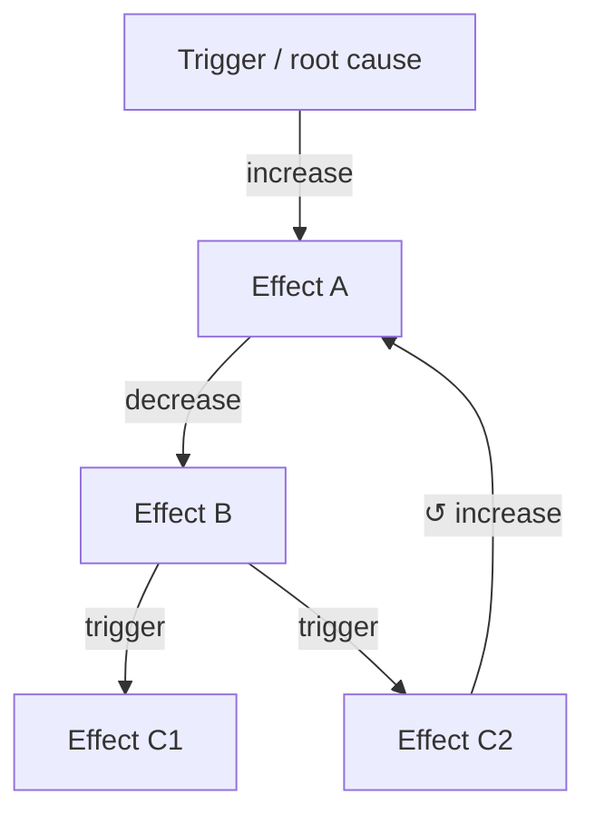

# Schema — Page format (detail)

> **Loaded on demand.** The lean core `CLAUDE.md` routes here via its Workflow router; read
> this file in full before creating or editing any wiki page. Cross-cutting invariants and the Hard Rules live in `CLAUDE.md`.

---

## Page format

Every wiki page must follow this template exactly. Omit sections that genuinely do not apply,
but do not invent sections not listed here.

```markdown
---
type: concept | tool | workflow | setup-guide | causal-chain | metaphor
sources: [list of raw/ paths this page draws from, e.g. raw/0003_03-sample-article/article.md]
external_knowledge: []   ← populated only if LLM knowledge fills a gap; each entry must cite a reputable source AND name the model used
moc_mirror: swapped-operand-slug   ← OPTIONAL, only on `-vs-` pages. The swapped-operand form of this page's slug (e.g. on functional-vs-conventional-paradigm → moc_mirror: conventional-vs-functional-paradigm). The home-page-moc generator reads it to emit a mirror entry under the other letter. It cannot be derived by string-swapping (a shared trailing noun must stay pinned), so it must be declared here.
tags: [2-5 lowercase tags]
last_updated: YYYY-MM-DD HH:mm:ss
---

# [Page Title]

## One-liner
One sentence. What is this, in plain language the target reader understands immediately.

## What it is
2-4 sentences. The concept, mechanism, or purpose. WHY it matters, not just what it is.

## How it works
[For concepts: the mechanism explained simply.]
[For tools: what the tool does and how it connects to the domain.]
[For workflows: numbered steps.]
[For setup-guides: numbered steps with exact commands or UI actions.]
[For causal-chains: see the Causal chain page format section below.]
[For metaphors: the full analogy and what each part maps to.]

## When to use it
[For concepts: when this concept becomes relevant in practice.]
[For tools: what problem this tool solves and when to reach for it.]
[For workflows: the trigger condition — when should someone run this workflow?]
[For setup-guides: prerequisites and when setup is needed.]
[For metaphors: which teaching moment this metaphor is designed for.]

## What causes this   ← Optional. Include on concept pages when this entity is an outcome or effect.
- [[upstream-entity]] — [increase | decrease | activate | inhibit | trigger | other]: [brief mechanism]
- [[another-upstream]] — [direction]: [brief mechanism]

## What this causes   ← Optional. Include on concept pages when this entity has downstream effects.
- [[downstream-entity]] — [increase | decrease | activate | inhibit | trigger | other]: [brief mechanism]
- [[another-downstream]] — [direction]: [brief mechanism]

> **Mandatory format for causal bullets.** Every bullet in `What causes this` / `What this causes`
> MUST lead with the target and an explicit direction token, then a colon, then prose:
> `- [[entity]] — <direction>: <mechanism>`. Use a wikilink when the target has, or warrants, its own
> page; otherwise use a plain **bold** noun phrase for the target (`- **detail fidelity** — decrease:
> …`). Do not bury the target or the direction inside a prose sentence (write
> `- [[compaction]] — trigger: at ~70-80% full, detail is summarized away`, NOT
> `- When the window fills, [[compaction]] triggers and detail is lost`). The lead `target —
> <direction>` is what makes upstream/downstream traversal and the symptom→cause-tree query reliable;
> the prose after the colon is for the human reader.

## Gotchas
[Optional. Only include if the source material explicitly calls out a common mistake,
 a counterintuitive behavior, or a failure mode worth knowing.]

## See source for fuller detail   ← Optional and RARE. Only when this page deliberately compresses
                                     something a reader would plausibly want in full. See the rule below.
- [brief description of what was condensed] — [[raw/0001_…/article.md]]

## Contradictions flagged   ← Only include when a known source conflict applies to this page.
- **[raw/file-a.md] vs [raw/file-b.md]:** [Description of conflicting claims.]
  LLM assessment ([model name], [YYYY-MM-DD HH:mm:ss]): [short plausibility analysis — see `schema/contradictions.md`]
  Contradiction severity: hard | soft | scope   ← REQUIRED. Exactly one token — the severity from the
                                                  Contradiction severity levels table (`schema/contradictions.md`), written
                                                  machine-readably so any automation can act on it
                                                  deterministically instead of guessing from prose.
  Last reviewed: [model name], [YYYY-MM-DD HH:mm:ss] — [unchanged | re-evaluated: <what changed>]   ← equals the
                                                  assessment timestamp at first flagging; bumped on every revisit
                                                  (see Aging and revisiting soft contradictions, `schema/contradictions.md`).
  Status: Unresolved — flagged for user review | Acknowledged — accepted as tentative (reviewed [ts]) | Resolved — kept [A/B] because [reason]

## Related
- [[page-slug]] — one-line description of the relationship
```

### The "See source for fuller detail" pointer — use it sparingly

Every wiki page is a deliberate compaction of its source: it synthesizes and drops detail by design.
Usually that is fine — the `sources:` frontmatter already records where the page came from, and `raw/`
is always available. The `See source for fuller detail` section is for the **occasional** case where a
page knowingly omits something a reader would plausibly want in full — e.g. the source lists six
sub-steps and the page summarizes them in one line, or the source gives exact figures the page rounds.

Rules:
1. **This is a rare, deliberate affordance — not a disclaimer.** It must point at a *specific* omission worth drilling into, with a one-line description of what was condensed and a link to the source.
2. **Never add it as boilerplate.** Do not put a generic "some detail may have been omitted, see source" on every page. A pointer that appears everywhere is noise readers learn to ignore, and it drowns out the rare pointer that actually matters. If in doubt, leave it off.
3. **It does not replace `sources:`.** Every page still lists its sources in frontmatter regardless; this section is an in-body signpost to a particular compressed spot, used only when that spot is worth flagging.

## Causal chain page format

`causal-chain` pages use this format instead of the generic template above.

```markdown
---
type: causal-chain
sources: [list of raw/ paths this chain draws from, e.g. raw/0003_03-sample-article/article.md]
external_knowledge:
  - claim: "[the bridging claim supplied by LLM general knowledge]"
    source: "[reputable source — author, publication, year, or URL]"
    model: "[exact model name/version that supplied this knowledge, e.g. claude-sonnet-4-6]"
    added: "[YYYY-MM-DD HH:mm:ss]"
tags: [tags]
last_updated: YYYY-MM-DD HH:mm:ss
---

# [Chain Name] — Causal Pathway

## One-liner
One sentence: what is the trigger, and what is the end state this chain traces?

## Chain (visual)

Two synced renderings of the ordered flow (both mirror the canonical Links table below).

**(a) Mermaid flowchart** (preferred) — renders as a graphical diagram on GitHub, in Obsidian, and
in VS Code with a Mermaid extension. Use `flowchart TD`, one node per entity, the direction token on
each edge label, and for a feedback loop draw the edge back to the earlier node with `↺` in its label:



**(b) ASCII fallback** — a plain-text version in a fenced code block that renders in any viewer with
no extension. At a branch, indent the sub-paths; for a feedback loop, draw the final arrow back to
the earlier node it feeds and label it `↺ loop`:

```
[Trigger / Root cause]
      ↓ increases
[Effect A]
      ↓ decreases
[Effect B]
      ↓ triggers
[Branching node] ──► [Effect C1]   (decrease)
                 └─► [Effect C2]   (increase)
```

## Links (canonical)

The machine-traversable representation — one row per causal edge. This table is the source of truth
for traversal and the symptom→cause-tree query; the diagram above is just its picture. Every row
MUST have an explicit direction token and a Source. Quote the source where possible (it makes each
link auditable); use `EXTERNAL` for any link supplied by LLM general knowledge (and fill in the
`external_knowledge` frontmatter + `External knowledge used` section).

| From | Direction | To | Mechanism | Source |
|------|-----------|----|-----------|--------|
| [[trigger-page]] | increase | [[effect-a-page]] | how the trigger causes A | raw/00NN_…/article.md — "quote" |
| [[effect-a-page]] | decrease | [[effect-b-page]] | how A causes B | raw/00NN_…/article.md — "quote" |
| [[effect-b-page]] | trigger | [[c1-page]] | how B causes C1 | EXTERNAL |
| [[effect-b-page]] | increase | [[c2-page]] | how B causes C2 | raw/00NN_…/article.md — "quote" |

(Branches are simply two rows sharing the same `From`. Direction token vocabulary: increase /
decrease / activate / inhibit / trigger / suppress / enable / block.)

**Feedback loops (cyclic chains).** A chain is a *loop* when a later node feeds back into an earlier
one. Represent the loop-back as a normal Links row whose `To` is an earlier node in the chain, and
mark that row by prefixing the `To` cell with `↺ ` (e.g. `↺ [[effect-a-page]]`) so traversal can
detect that the edge closes a cycle rather than continuing forward. Every cyclic chain MUST also
carry a `## Loop` section (below) naming the loop-back edge and whether the loop is **reinforcing**
(amplifies — each pass strengthens the cycle, e.g. a virtuous/vicious circle) or **balancing**
(dampens — each pass moves toward equilibrium). A chain with no loop-back row is linear; omit the
`## Loop` section for it.

## Node index
All nodes in this chain, in order: [[trigger-page]], [[effect-a-page]], [[effect-b-page]], [[c1-page]], [[c2-page]]
[For a cyclic chain, append: `(cyclic: [[last-node]] loops back to [[earlier-node]])`.]

## Loop   ← Only for cyclic chains (feedback loops). Omit entirely for linear chains.
This chain is a feedback loop: [[last-node]] feeds back into [[earlier-node]] (<direction>), making
it **reinforcing** | **balancing**. One pass around the loop: [one line on what each cycle does and
what, if anything, eventually limits it].

## External knowledge used
[Only include if any link came from LLM general knowledge rather than a source document.]
- **[Bridging claim]** — Source: [reputable citation] — Model: [model name/version] — Added: [YYYY-MM-DD HH:mm:ss]

## Contradictions flagged
[Only include if a source conflict affects this chain.]
- **[raw/file-a.md] vs [raw/file-b.md]:** [conflicting claims]. Contradiction severity: hard | soft | scope. Last reviewed: [model], [ts]. Status: Unresolved | Acknowledged — accepted as tentative | Resolved — [reason]

## Related
- [[related-chain]] — description of how the chains connect
```

---

## File naming

- Use kebab-case for all wiki page filenames: `context-window.md`, `manual-compaction.md`
- Match the page title closely but keep it short: `water-tank.md` not `the-water-tank-metaphor-for-context-capacity.md`
- Wikilinks use the filename without extension: `[[context-window]]`, `[[manual-compaction]]`
- **Use sentence case for page titles and all headings** — capitalize only the first word plus proper
  nouns and literal tokens (`Firecrawl`, `CLAUDE.md`); do not use title case. Write `## How it works`,
  not `## How It Works`. This matches the standard documentation style (Google / Microsoft / GitHub
  guides) and is easier to apply consistently than per-word title-case judgments. Two deliberate
  exceptions, both proper labels rather than prose headings: a document's H1 title (e.g. the wiki's own
  name) and the fixed page-type category labels in `index.md` (`Concepts`, `Tools`, `Setup Guides`,
  `Causal Chains`, `Metaphors`).

---

## Source attribution

Every wiki page must list its sources in frontmatter. When writing or updating a page, attribute
claims to the specific source document they came from. If two sources cover the same topic, list
both. If a claim comes from LLM general knowledge rather than a source document, it must appear in
`external_knowledge` frontmatter — never in the `sources` list.

When source documents have named authors or co-authors, record them in a comment at the top of the
page so attribution is preserved as the wiki is updated.
